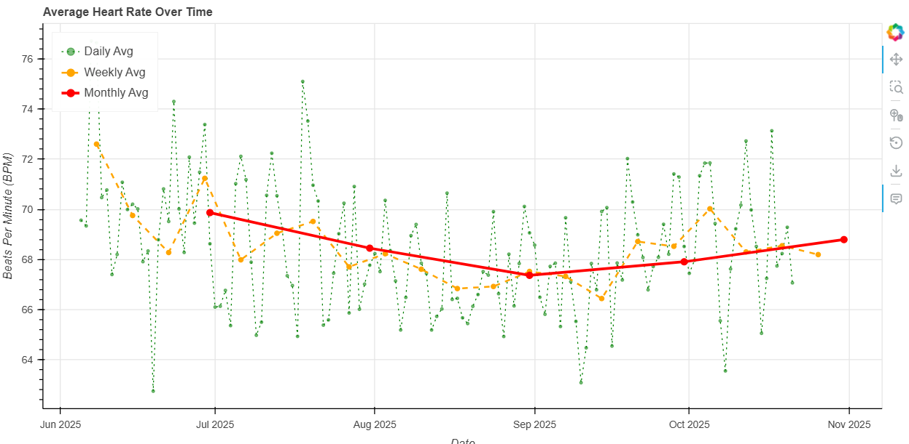

# Android Health Connect Data Explorer

A Python script to analyze your exported Android Health Connect SQLite database, focusing on heart rate data. It calculates daily, weekly, and monthly averages and can display them in the console or as a beautiful, interactive graph.



## Why?

Android's Health Connect "export data" feature gives you a raw SQLite database file, but it's not in a human-readable format. This script connects directly to that database, extracts the most useful data (your heart rate), and turns it into easy-to-understand averages.

## Features

* **Direct SQLite Connection:** Reads your `.db` export file directly.
* **Time-Series Analysis:** Parses your raw heart rate data (`heart_rate_record_series_table`).
* **Multiple Averages:** Automatically calculates daily, weekly, and monthly heart rate averages.
* **Two Output Modes:**
    * `console`: Prints clean, formatted tables of your averages right to your terminal.
    * `graph`: Generates a beautiful, interactive HTML graph using [Bokeh](https://bokeh.org/). The graph includes pan, zoom, and hover tooltips to inspect specific dates.
* **Data Filtering:** Use the `--max-bpm` flag to easily filter out noise or irrelevant high-intensity readings (e.g., from exercise) to focus on your resting trends.

## Installation

1.  **Clone the repository:**
    ```bash
    git clone https://github.com/verybadsoldier/android-health-connect-data-explorer.git
    cd android-health-connect-data-explorer
    ```

2.  **Create a virtual environment (Recommended):**
    ```bash
    # On macOS/Linux
    python3 -m venv venv
    source venv/bin/activate
    
    # On Windows
    python -m venv venv
    .\venv\Scripts\activate
    ```

3.  **Install the required libraries:**
    ```bash
    pip install -r requirements.txt
    ```

## Usage

You will need the path to your exported Health Connect database file (e.g., `health-connect-export.db`).

### To Output Averages to the Console:

This is the default behavior.

```bash
python health_analysis.py /path/to/your/health-connect-export.db
```

### To Generate the Interactive Graph:

This will open the graph in your default web browser.

```bash
python health_analysis.py /path/to/your/health-connect-export.db --output graph
```

### To Filter Data:

Here's how to generate a graph that ignores any heart rate readings above 90 BPM.

```bash
python health_analysis.py /path/to/your/health-connect-export.db --output graph --max-bpm 90
```

---

## **Important: Database Schema**

This script is built assuming the heart rate data is in `heart_rate_record_series_table` with the following columns:

* **Timestamp column:** `epoch_millis`
* **Heart rate column:** `beats_per_minute`

If your database export has a different structure, the script will likely fail. If this happens, you will need to edit the `sql_query` variable inside the `fetch_heart_rate_data` function in `health_analysis.py` to match your schema.

A helper function `inspect_table_columns` is included in the script (commented out in `main()`) which you can use to help find the correct column names if needed.

## License

This project is licensed under the MIT License. (You can add a `LICENSE` file to your repo by clicking "Add file" > "Create new file" on your repo's main page. Type `LICENSE` as the filename and GitHub will offer you an MIT template.)
